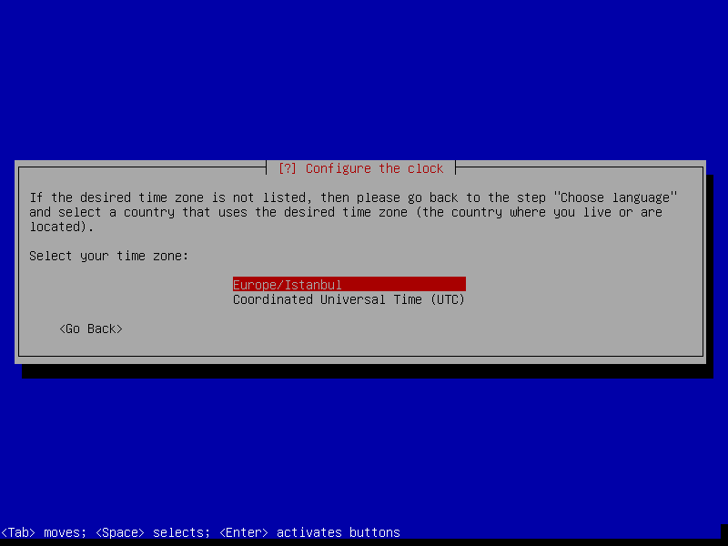
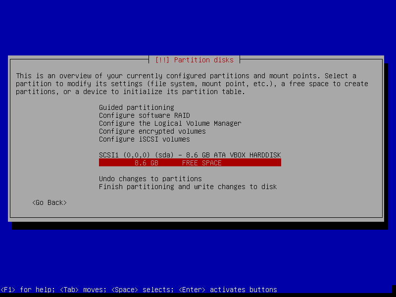
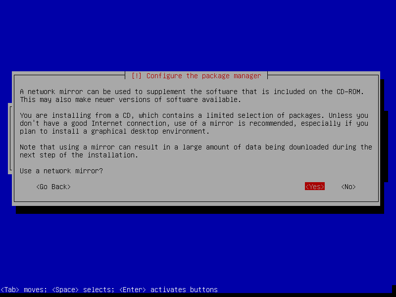

How to install Debian Jessie
============================

[Get Debian Jessie 8.2 CD 1](http://cdimage.debian.org/debian-cd/8.2.0/amd64/iso-cd/debian-8.2.0-amd64-CD-1.iso)

#### Select Advanced Mode

#### Enter the Expert Install

#### Choose Language

#### English

#### Choose Other Section

#### Enter the Asia Region

#### Select Turkey Country

#### Default locale settings is en_US.UTF-8

#### Select Turkish locales

#### Default Locale ise en_US.UTF-8

#### Enter the Configure Keyboard

#### Turkish Q Layout Select

#### Detect and CD-Rom 

#### Select USB Storage Module

#### Show detected Devices

#### Load Installer Component From CD

#### Just Press Enter

#### Loading Installer Components from CD

#### Detect network Hardware

#### Configure Network

#### If using DHCP Please Select YES

#### Waiting Link Detection

#### If configure static IP please select NO

#### Enter IP Adress

#### Enter Netmask

#### Enter Gateway

#### Enter name server

#### Check Confirm

#### Static Link Detection

#### Enter Hostname

#### Enter Domain Name

#### Set up users and Passwords

#### Enable shadow Password

#### Enable root login

#### Enter root password

#### Retype root password

#### If you want a non-root user please select Yes

#### Enter Full Name Ex: John Doe

#### Enter username Ex: john

#### Enter Password

#### Retype Password

#### Configure the clock Settings

#### If using NTP select Yes

#### Enter timezone server address

#### Select timezone

#### Detect Disk

#### Partioning Disk

#### Select Manual 

#### Select Disk

#### Create new empty partition

#### Select GPT (GNU Partition Table)
If using UEFI select MSDOS

#### Select Free Space for swap area

#### Create new partition for swap

#### Swap Size 
Formula is physical ram X 2 
I have 512 MB ram, Swap size is 1GB

#### Select begining

#### Change Ext4 to Swap

#### Select swap area

#### Done settings for swap partition

#### Create 1 GB partition for /boot. Select mount point

#### Choose /boot section

#### Enter mount point options

#### Add noatime option

#### partioning-disks-boot-mount-done-settings.png

#### partioning-disks-select-free-size.png

#### partioning-disks-root-partition-size.png

#### partioning-disks-root-partition-done-settings.png

#### partioning-disks-finish-partioning.png

#### partioning-disks-write-to-disk.png

#### install-the-base-system-select.png

#### install-the-base-system-select-installing.png

#### install-the-base-select-linux-image.png

#### install-the-base-select-generic-devices.png

#### configure-the-package-manager.png

#### configure-the-package-manager-scan-other-cd-no.png

#### configure-the-package-manager-using-network-yes.png

#### configure-the-package-manager-using-network-http.png

#### configure-the-package-manager-using-network-mirror-country-Turkey.png

#### configure-the-package-manager-using-network-mirror-country-archive.png

#### configure-the-package-manager-using-network-proxy-blank.png

#### configure-the-package-manager-non-free-no.png

#### configure-the-package-manager-contrib-no.png

#### configure-the-package-manager-updates.png

#### select-and-install-software-select.png

#### select-and-install-software-survey-no.png

#### select-and-install-software-select-only-ssh-service.png

#### install-grub-select.png

#### install-grub-master-boot-record-yes.png

#### install-grub-select-device-select.png

#### install-grub-select-efi-no.png

#### finish-installation.png

#### finish-installation-set-utc.png

#### finish-installation-restart.png

